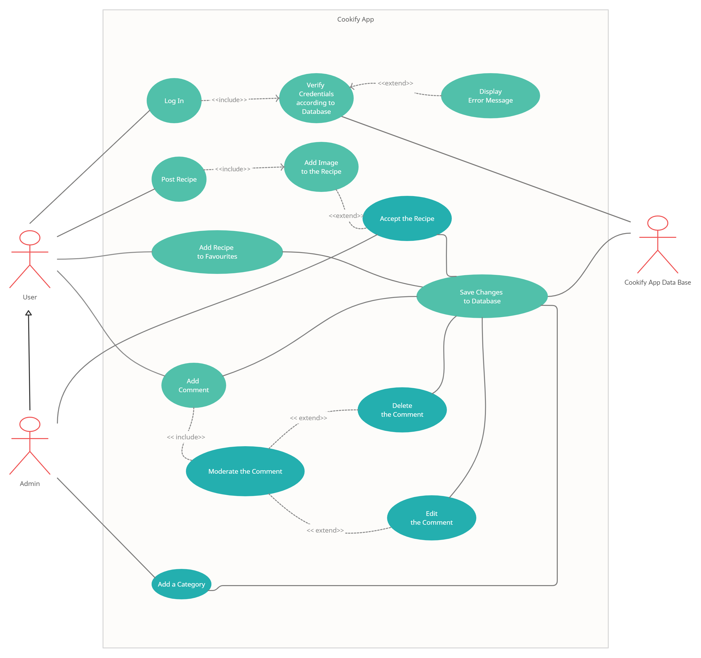
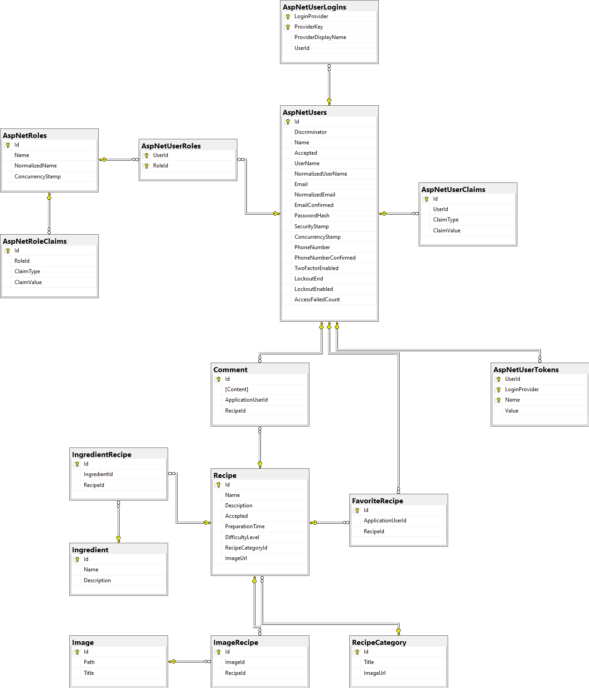
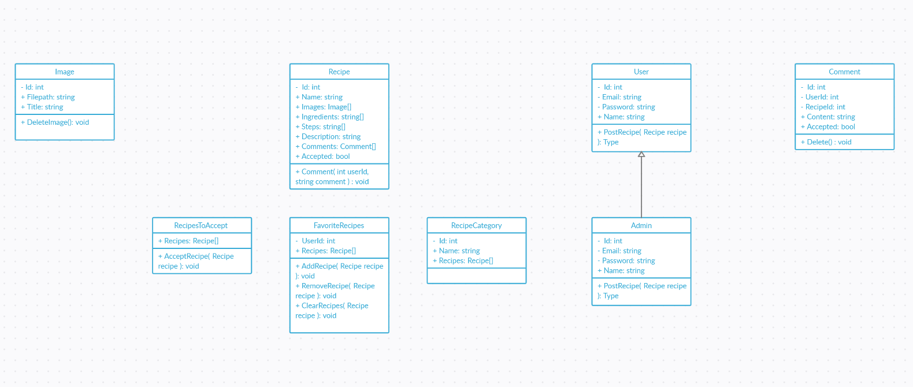

# Aplikacja Cookify

## Analiza SWOT

**S - (Strengths)** – mocne strony: wszystko to co stanowi atut, przewagę, zaletę:

 - zgrany zespół,
 - doświadczenie jak i pasja do gotowania i pieczenia,
 - znajomość technologii pozwalających na zbudowanie prostej i eleganckiej aplikacji,
 - zapotrzebowanie na pomysły na posiłki,
 - możliwość interakcji z użytkownikami poprzez potencjalne publikowanie dobrze skonstruowanych przepisów.

**W - (Weaknesses)** – słabe strony: wszystko to co stanowi słabość, barierę, wadę:

  - Wąska grupa docelowa odbiorców
  - Ograniczone możliwości rozwoju aplikacji
  - Duża konkurencja w postaci podobnych aplikacji
  - Konieczna weryfikacja przepisów dodanych przez użytkowników 
  - Konieczność posiadania rozbudowanej bazy przepisów na start

**O - (Opportunities)** – szanse: wszystko to co stwarza szansę korzystnej zmiany:

 - portal dotyczący konkretnej tematyki i związany tylko i wyłącznie z nią (gotowanie, przepisy, porady kulinarne),
 - jedna duża baza przepisów i produktów dostępna dla każdego,
 - zgromadzenie w jednym miejscu pasjonatów gotowania zarówno tych początkujących, jak i bardziej doświadczonych,
 - szansa na stworzenie czegoś na wzór portalu społecznościowego pozwalającego użytkownikom na dzielenie się wszelkiego rodzaju treściami dotyczącymi tematyki kulinarnej.

**T - (Threats)** – zagrożenia: wszystko to co stwarza niebezpieczeństwo zmiany niekorzystnej:

  - istnienie podobnych aplikacji bądź też stron o podobnej tematyce,
  - możliwość pojawienia się podobnych aplikacji bądź też stron o podobnej tematyce,
  - konkurencja kopiująca pomysły,
  - zmiana potrzeb potencjalnych odbiorców aplikacji,
  - nowe prawa i regulacje,
  - SPAM oraz niechciane reklamy,
  - aktualizacja software’u przeglądarki.

## Dokumentacja aplikacji Cookify

### 1. Karta projektu.

Opis wizji projektu:
   - Cookify to aplikacja przeznaczona dla fanów gotowania i pieczenia. Będzie pozwalać użytkownikom na odkrywanie nowych przepisów, dzielenie się własnymi wykonaniami potraw ze strony, a nawet wysyłanie własnych pomysłów z szansą na ich publikację w naszej aplikacji.

Cel strategiczny projektu:
   - celem strategicznym jest dostarczenie jak najlepszego środowiska dla pasjonatów gotowania i stworzenie społeczności. Aplikacja ma podpowiedzieć pomysł, pokazać jakie składniki są potrzebne, przeprowadzić w sposób zrozumiały przez proces przygotowania posiłku oraz dać możliwość wyrażenia opinii o nim.

Cele projektu:
  - zbudowanie witryny internetowej z przejrzystym i prostym interfejsem,
  - zapewnienie dużej i różnorodnej bazy przepisów,
  - zapewnienie możliwości wymiany opinii na temat dań, sposobów gotowania użytkownikom między sobą, żeby budować dużą społeczność pasjonatów gotowania.

Zakres projektu:
  - opracowanie aplikacji webowej,
  - kampania reklamowa w mediach masowych.

Etapy projektu:
  - opracowanie koncepcji, zatrudnienie niezbędnych osób (2 miesiące),
  - opracowanie aplikacji webowej umożliwiającej dzielenie się przepisami (6 miesięcy),
  - testy przygotowanego rozwiązania (1 miesiąc),
  - publikacja, działania reklamowe,
  - rozbudowa funkcjonalności.

### 2. Analiza rynku:

  - istnieje spora ilość portali dla miłośników gotowania (gotujmy.pl, mediaknorr.pl, przepisy.pl by wymienić kilka),
  - portale te jednak są wykonane w mizerny sposób, w czym upatrujemy swojej szansy,
  - dla wielu osób pierwszym krokiem przed wykonaniem przepisu jest wyszukanie go w internecie. Przy odpowiednim pozycjonowaniu strony istnieje szansa, że użytkownik wejdzie na naszą aplikacje jako pierwszą,
  - wieczny popyt. Ludzie muszą jeść, a czasem najdzie ich ochota na zrobienie czegoś samemu.

### 3. Ryzyka:

  - istniejące aplikacje realizujące podobne założenia,
  - powstawanie aplikacji o podobnej tematyce,
  - konkurencja kopiująca pomysły,
  - nowe prawa i regulacje,
  - aktualizacje software`ów przeglądarkowych.

### 4. Plan realizacji projektu:
  - stworzenie projektu graficznego aplikacji,
  - wybranie technologii najlepszych do wdrożenia strony internetowej,
  - ustalenie struktury bazy danych,
  - rozdzielenie zadań odnośnie kodowania wśród członków projektu,
  - stworzenie struktury bazy danych,
  - kodowanie frontu strony internetowej,
  - testowanie strony,
  - wybranie platformy do wypuszczenia strony internetowej,
  - wypuszczenie aplikacji.

### 5. Scenariusz przypadków użycia (User Stories):
    
  - jako użytkownik aplikacji chcę mieć kilka możliwości wyszukiwania przepisów, żeby znaleźć jak najbardziej odpowiedni,
  - jako użytkownik aplikacji chcę mieć dużą bazę przepisów, żeby mieć duży wybór,
  - jako użytkownik aplikacji chcę mieć możliwość zapisu ulubionych przepisów, żebym mógł je szybko i łatwo znaleźć,
  - jako użytkownik aplikacji chcę mieć możliwość wyrażenia opinii, żeby ocenić dany przepis,
  - jako użytkownik aplikacji chcę mieć możliwość planowania posiłków, żeby na tej podstawie generowała się lista potrzebnych składników,
  - jako administrator aplikacji chcę mieć możliwość weryfikacji przepisów dodanych przez użytkownika, żeby mieć pewność, że są odpowiedniej jakości,
  - jako użytkownik aplikacji chcę mieć możliwość podzielenia się własnymi przepisami, żeby inni użytkownicy mogli je wypróbować,
  - jako użytkownik aplikacji chcę prosty i przejrzysty interfejs, żeby obsługa była szybka i intuicyjna,
  - jako administrator aplikacji chcę mieć rozwiązanie premiujące dodawanie nowych przepisów przez użytkowników, żeby ich zachęcić do rozbudowywania bazy przepisów, 
  - jako użytkownik aplikacji chcę mieć możliwość zapisu przepisu w aplikacji, żeby mieć możliwość dostępu offline.

### 6. Przypadki użycia (Use Cases).

### 7. Diagram tabel bazy danych.

### 8. Diagram klas.

